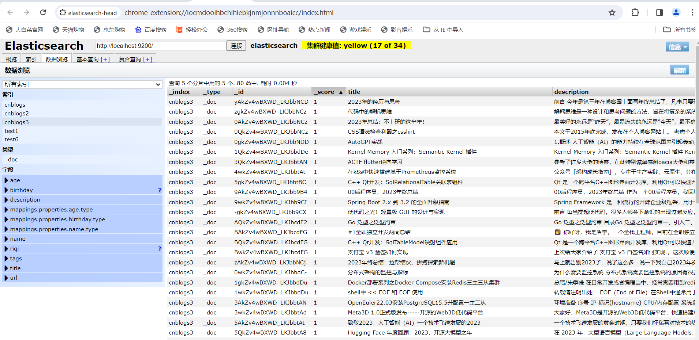
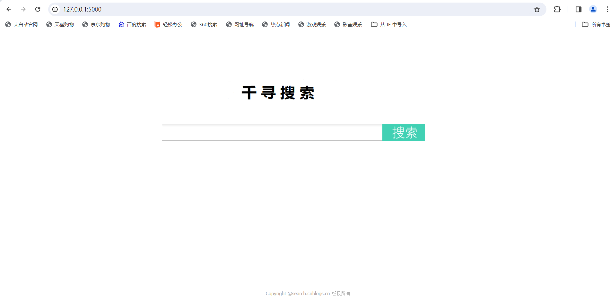
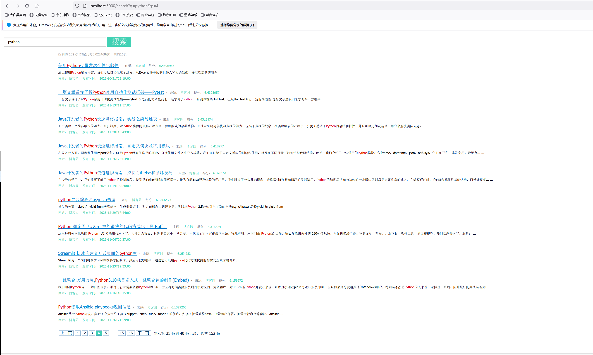
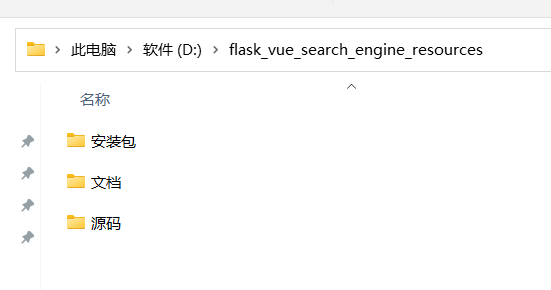
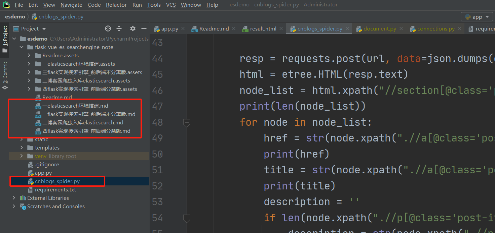
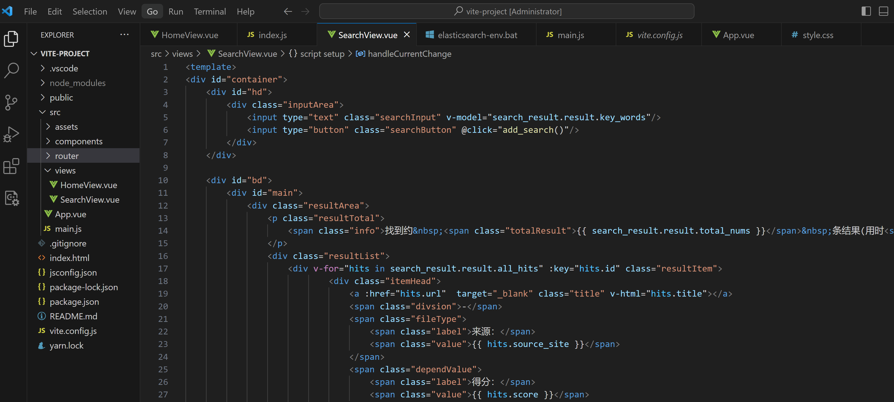
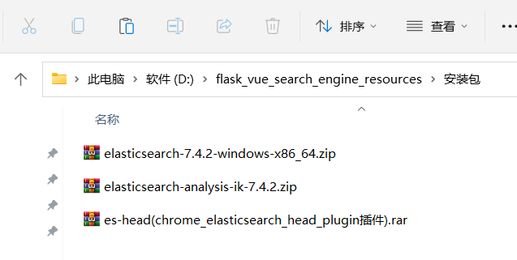

### 项目简介

Flask+ElasticSearch+python爬虫技术实现的搜素引擎项目

### 项目截图

爬虫数据入库ElasticSearch

首页：

搜索 结果页：

### 备注

另有

- python博客园爬虫并入库ElasticSearch代码

- Vue3+Flask+ElasticSearch实现的前后端分离版搜索引擎项目

- 手把手开发文档

- ElasticSearch相关安装包

  有需要的加V：tiantiancode 备注[Flask搜索引擎项目]。

  或直接去面包多购买https://mbd.pub/o/bread/ZZmXk5ht（关注面包多即可）

  

